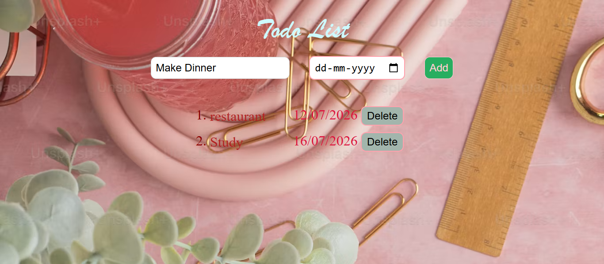

# 📝 Dynamic Todo List with Micro-Interactions

A vibrant, background-styled web task manager that pairs functional productivity tracking with delightful, tactile UI micro-interactions.

## 🚀 Live Demo
[👉 Click here to manage your tasks live!]( https://priya-bhagat01.github.io/my_todoList_project/)

## 📸 Preview

## 🛠️ Core Features & Interaction Details
- **Task & Date Management:** Dynamically creates, maps, and structures items with matching deadline targets using native date pickers.
- **Tactile Micro-Interactions:** Engineered custom CSS scale transitions (`0.2s`) on the **Add** and **Delete** buttons to achieve a light, organic "squishy" physical-click behavior.
- **Asynchronous Rendering:** Leverages vanilla JavaScript DOM manipulation to instantly inject and remove structural array nodes without page refreshing.

## 🧰 Tech Stack
- HTML5
- CSS3 (Transitions & Transforms)
- JavaScript (ES6 Arrays & DOM Selection)
